

# **Mr. Pregame**
View the live project [HERE.](https://mrpregame.herokuapp.com/)

***

## **Introduction**

Mr. Pregame Sports Betting Management plans to be a one stop shop for all sports betting research and bet tracking. As the Sport Wagering industry legalizes and grows in the states, I find that in order to make educated decisions on which teams to bet on you have to bounce around to three or four different sites to get everything you need and then another app to track all the bets that you've made. My plan with Mr. Pregame was to simplify that whole process and offer all the services for free in one place. For users that want an expert opinion or skip the whole pregame research all together, using a subscription model Mr. Pregame offers expert analysis and guaranteed picks. 

Click [here](https://github.com/RyanRayn/mr_pregame) to view the GitHub repository for the project.

To test the payment transaction prodess please use:

* Credit card number: 4242 4242 4242 4242
* Expiration date: 04/24
* CVC: 242
* ZIP: 42424
***

## **User Experience (UX)**

**Strategy**

As the developer and also an avid sports bettor, I initially started the design process from the mindset of the user. As I would be developing a platform that I, myself was in need of. During this design process I quickly had to switch hats and start thinking from a developers view to take into consideration scalability, functionality and regular maintenence.

**General**

1. As the developer, I wanted to create a full-stack e-commerce site where users can add, edit and delete data.

2. As the developer, I want the website to function well and be fully responsive to demonstrate my coding abilities.

3. As the site owner, I would like as much data as possible autogenerated through API's.

**Aesthetic and UX**

4. As the developer, I want the site to be aestetically pleasing and easy to use to create a positive UX experience for users.

5. As the site owner, I want to create a brand that would welcoming and easy to market.

6. As the site owner, I want to create a rapport with the users and develop trust to eventually upgrade members to a paid membership that offers professional game analysis.

7. As the site owner, I want to create a complete hassle free environment for users through a ease of navigation and accessibility to cancel memberships.

8. As the site owner, I would like to automate as many functions as possible.

**Registration and Subscribing**

9. As a site user, I would like to easily register for an account.

10. As a site user, I would like my account to be secure.

11. As a site user, I would like access to my information to update and delete whenever I want.

12. As a site user, I would like to be able to cancel my subscription without a hassle.

**Navigation**

13. As the site owner, I would like users to be able to navigate in and out of every page without hitting the back arrow.

14. As the site owner, I would like users to always have access to the 'Subscribe' button if they aren't currently subscribed.

15. As the site owner, I would like all the daily games organized by sport/leagues.

**Checkout**

16. As a site user, I want to be able to easily and quickly enter my payment details, so I can checkout quickly, hassle free.

17. As a site user, I want my monthly subscription fee directly charged to my credit card without having to re-enter information.

**Admin**

18. As the site owner, I would like to quickly update game lines and stats.

19. As the site owner, I would like to easily write and show game breakdowns and picks for subscribers.

**Structure**

Base all the required features and data that needed to be shown for users, I decided I wanted to include the following pages on my website:

* The Home page welcomes the user to the site and presents the user with calls to action to subscribe for a paid membership.

* The log in and sign up pages allow users to log in and create their memebership.

* The Suscribe page allows users to enter all their billing info and start their monthly subscription.

* The Profile page (paid subscribers only) displays all the game picks for that given day. Profile page also has a link to edit profile information, email, passwords and cancel subscriptions. Coming soon, paid users will also have bet tracking available which will be displayed in the profile.

* The Games page is linked to an API call. From the home page when you hover on 'Games' a dropdown appears with all the leagues available,  MLB, NCAA Basketball, NBA or NFL. Once the user selects the league, data is pulled via API to display teams, times, locations, game lines as well as a button to go to the Matchup Page.

* The Matchup Page has all the data and stats for the teams involved in the game chosen. As well as game picks and a carousel that cycles through all the other games of that day.

**Wireframes**
* Wireframes were created using Balsamiq Wireframes and can be found [HERE.](https://github.com/RyanRayn/mr_pregame/blob/master/media/mr_pregame_wireframes.png)

**Color Scheme**
* I wanted to have a darker website so it is easier on the eyes while studying all the numbers and data so the primary background color is rgb(13, 29, 53). An opacity of 90% was also placed on all bright colors to tone them down a bit.

* The main colors used throughout the site are:

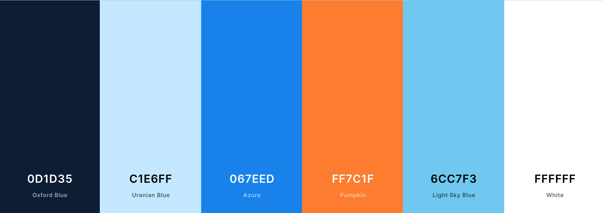

**Fonts**

* The two fonts used on Mr. Pregame are Oswald and Montserrat with sans-serif as a backup.

***

## **Information Architecture**

With all the different sports and teams there are several different models for data.

**Profiles App** 

The Profiles app models are primarily used for Stripe and subscription functionality.

*UserProfile*

In addition to Django's user model, a custom model was created as well, UserProfile, to store profile information.

* user : One to One relationship with Django's User
* full_name : Users full name for billing
* email : User email for billing
* active : Boolean field to keep track of active paid sub.
* stripe_customer_id : ID code Stripe assigns to each user
* membership_type : Paid or Free
* stripe_subscription_id : Id is assigned by Stripe when a paid subscription is created for the user
* phone_number : Phone for billing
* country : Address for billing
* postcode : Address for billing
* town_or_city : Address for billing
* street_address1 : Address for billing
* street_address2 : Address for billing

*Memberships*

Membership model is created as a part of the Stripe subscription plans.

* membership_type : Paid or Free
* price : 0 or $30/month
* stripe_plan_id : Id code to select membership on Stripe platform

**Management App**

The management app is the heart of Mr. Pregame. All of the teams, leagues and games data is stored here.

*League*

* Contains the four different leagues on offer which are foreign keys to the teams in the TeamName model.

*TeamName*

* name : Full name of each team
* abbreviation : Abbreviation of team names
* twitter_id : Each teams unique twitter id to be called on for the twitter API
* league : Foreign key

*Season*

A code created for each season to store data under.

* name : Name of season
* teams : Many to many field to the TeamName model

*BasketballTeamStats*

With 24 fields, this model is where game stats are stored from each individual game. This model contains two foreign keys...

* name : Foreign Key TeamName
* season : Foreign Key Season

*MLBGame*

Another big model that stores all the data from each individual Major League Baseball Game. This model also contains two foreign keys.

* name : Foreign Key TeamName
* season : Foreign Key Season

*StartingPitcher*

This model keeps track of all the starting pitching stats for each game. Contains two foreign keys.

* teams : Foreign Key TeamName
* season : Foreign Key Season

*MLBGameLine*

This model holds the betting info for each game that is collected from a sports betting API. This model also holds all of the game picks done by 'Mr. Pregame.

***

## **Features and Apps**

*Registration and User Accounts*

* For the subscription model used, the site must allow users to create an account they can log in and out of. This is achieved by using the Django AllAuth plug-in which provides users with secure log in and registration functionality.

* After registering, the Django AllAuth confirms registration details through email confirmation which provides users with the ability to recover lost or forgotten passwords.

*Subscription and Billing*

* Subscriptions are created and billing managed by using the Stripe Payments API.

* Billing is made easy by allowing payments to be securely debited from credit cards on a monthly basis.

* Using Stripe webhooks, subscriptions are automatically frozen and an email is sent out to the user if there is a missed payment.

* In the profile app users can easily cancel their paid subscription with the click of a button.

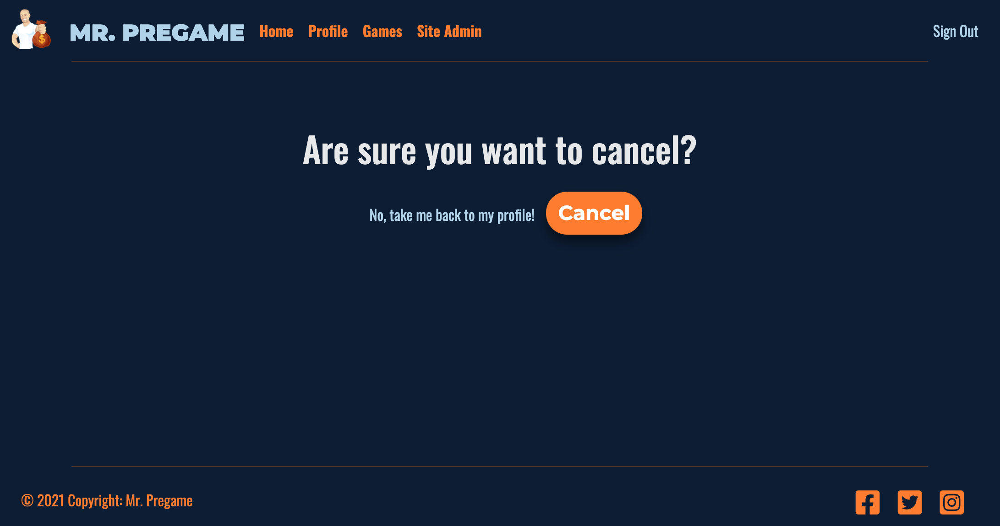

As a whole, Mr. Pregame is comprised of five Django apps containing multiple features.

*Home*

* The home app contains multiple calls to action. For unauthorized users there are several buttons encouraging them to register as well as a social media toolbar directly in the center of the page and in the footer.

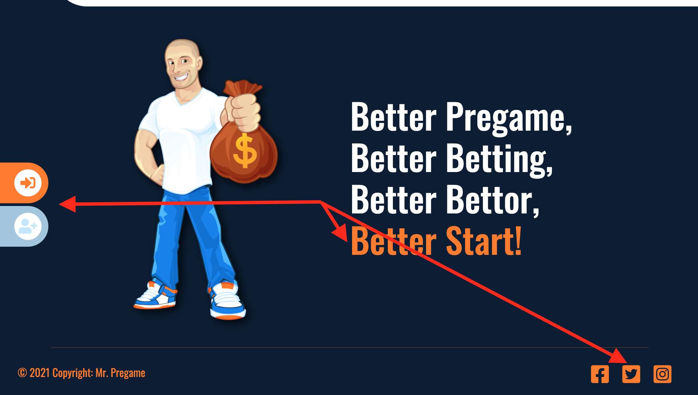

* For paid subscribers, after logging in they are greeted with a personalized welcome containing their user name and the guaranteed pick of the day.

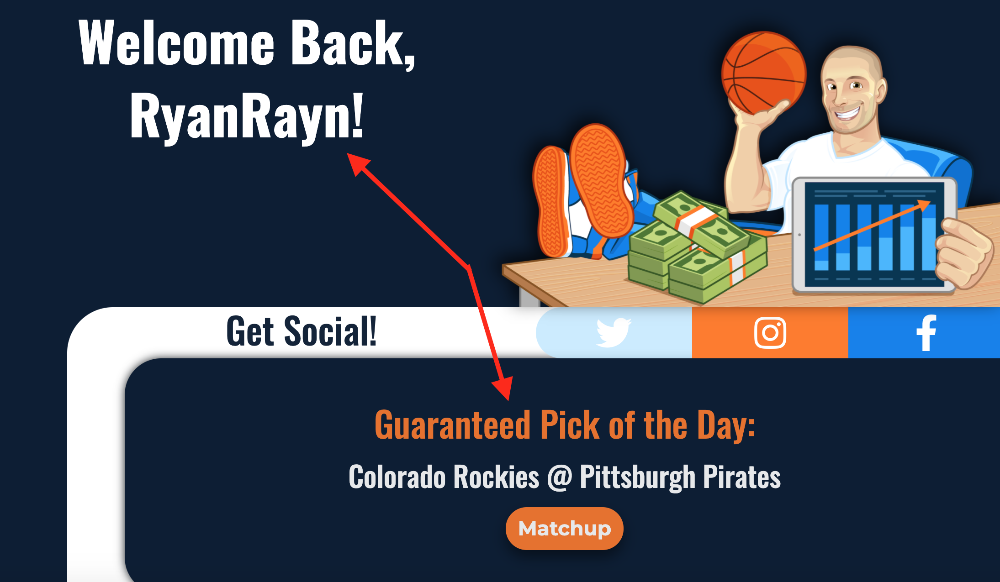

*Games*

* When hovered over the 'Games' link in the navbar, a dropdown appears containing the four leagues on offer (currently only MLB is functional due to the other leagues not in season). Once the user selects a league they are directed to the Games page that contains all the games for that date.

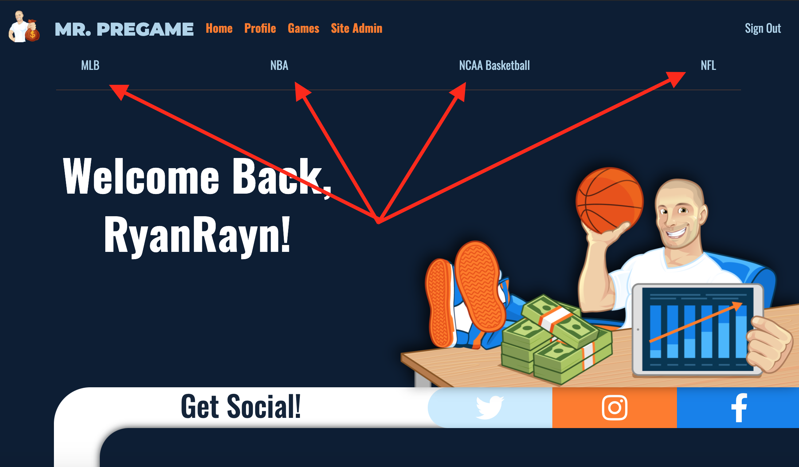

* The gamecards on the Games page contain all the betting information for that game as well as a button that leads them to the matchup page which breaks down all the stat comparisons for the two teams. For admin there is also a link on top of each gamecard that allows them to edit any game line information.

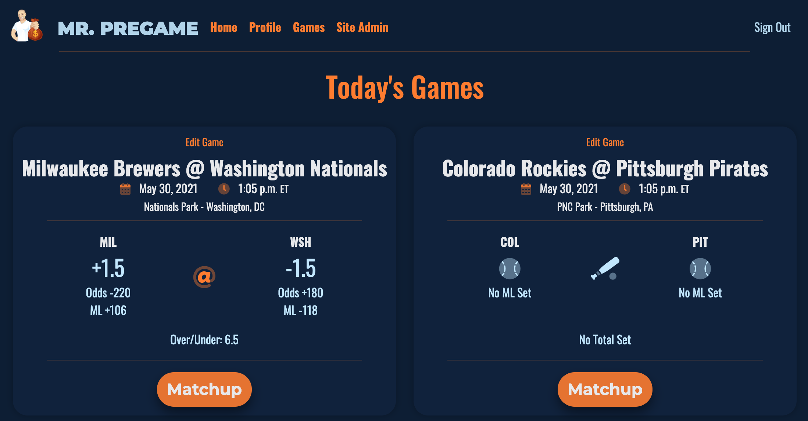

*Matchup*

* The matchup app is where all the magic happens. Linked from the gamecards on the games page or the game picks in paid subscribers profiles, the matchup page displays all the data for the two teams playing in the chosen game.

* Each matchup has season stats, player stats, betting info, game picks and gameday weather via Open Weather Map API. Using the Twitter API, team news that comes direct from each teams Twitter feeds is also displayed. 

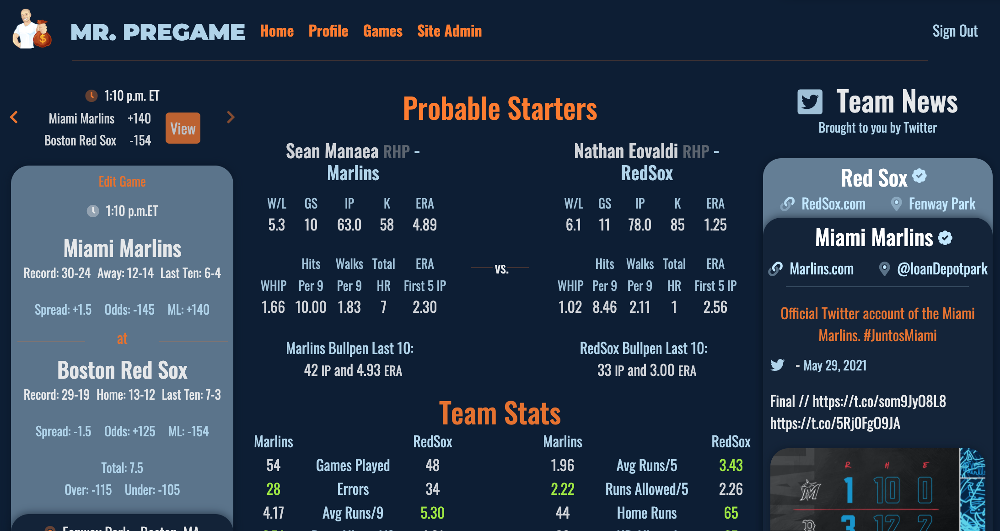

* Using Javascript each statistical advantage is highlighted in green in the team stats section and the trend charts were made using ChartJS.

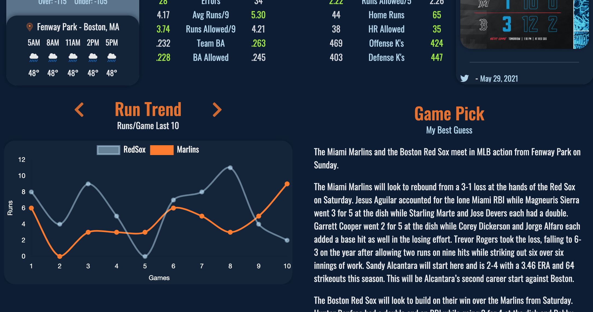

*Profile*

* Currently the profile app is home to all the gameday picks and personal billing information as well as links the cancel subscriptions, change email or passwords.

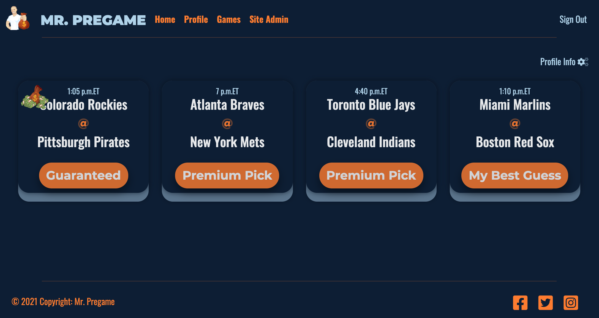

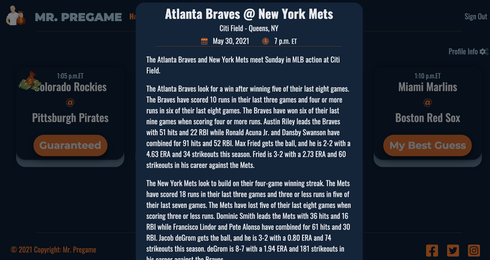

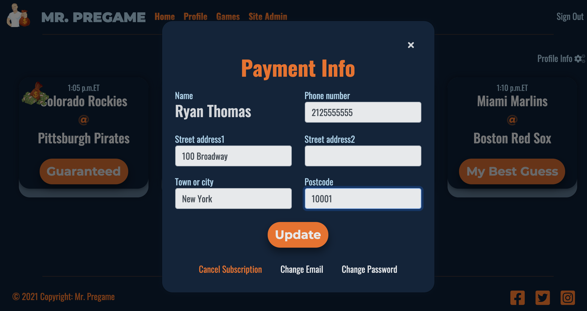

* A new feature coming soon that will aso be displayed in the profile app is the ability to track bets and keep track of wins and losses.

*Management*

* Management app is for admin users only. Using Django forms, this is where they can edit or create game and team data.

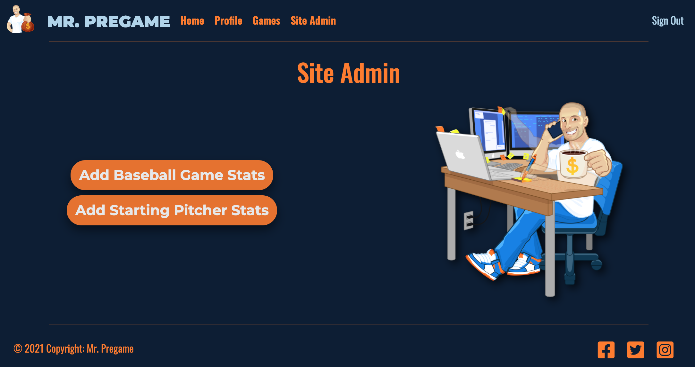

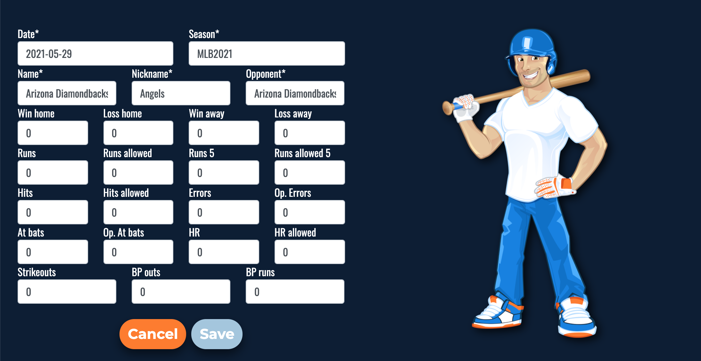

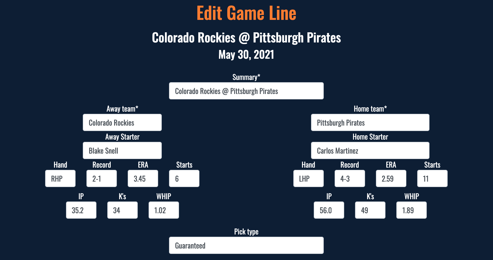

**Defensive Design Features**

I implemented a number of defensive design features throughout my code to protect the site against malicious use.

* Designed custom 404 and 500 error pages which allows the user with an easy route back to a non-problematic page via the navbar in the event of an error.

* I used to code in management views to restrict anyone who isn't a superuser from accessing those pages. Instead they will be redirected back to the homepage with an error message displayed via toasts.

**Features Left To Implement**

* Bet tracking: One of the most important features to be on the site is the ability to keep records of bets made in the users profile.

* Cron job: Do to the amount of data being pulled from API's several pages load slowly. My plan is to add Cron jobs to have the data pulled in the background on a schedule instead of as the page is loading.

* Getting Social: Allow users to log in via social media and share bets made or other data.

* Blog: Implement a blog page that contains insights and articles.

***
## **Technologies Used**

**Languages and Frameworks**

* HTML: 
    * The language used to create the content and structure of my project.

* CSS: 
    * The language used to style the HTML5 elements to create the aesthetic of my site.

* [jQuery 3.5.1:](https://code.jquery.com/)
    * jQuery was use multiple time throughout this project.

* [JavaScript 4.5.2:](https://getbootstrap.com/docs/4.0/getting-started/javascript/) 
    * JavaScript was used multiple times, most notably with the Stripe Payments and ChartJS.

* [Python:](https://www.python.org/) The language used to write the logic that controls my site.

* [Bootstrap 4.5.0:](https://getbootstrap.com/) 
    * Bootstrap was used to assist with the responsiveness and styling of the website.

* [Django:](https://www.djangoproject.com/) A high-level Python web framework used to control my site.

* [Heroku:](https://www.heroku.com) I used Heroku to deploy my project and make it viewable to others.

* [SQLite:](https://www.sqlite.org/index.html) The default database used in Django development.

* [PostgreSQL:](https://www.postgresql.org/) The production database used through Heroku.

* [AWS S3:](https://aws.amazon.com/) I used AWS for hosting media and static files on the Cloud.

* [GitHub:](https://github.com/) I used GitHub to store my source code and repository.

* [Git:](https://git-scm.com/)
    * Git was used for version control by utilizing the Gitpod terminal to commit to Git and push to Github.

**Additional Tools Used**

* [Google Fonts:](https://fonts.google.com/) 
    * Google fonts were used to import the "Montserrat" and "Oswald" fonts into the style.css file which is used on all pages throughout the project.

* [Font Awesome:](https://fontawesome.com/)
    * Font Awesome was used on all pages throughout the website to add icons for UX purposes.    

* [Balsamiq:](https://balsamiq.com/)
    * Balsamiq was used to create the wireframes during the design process.

* [Stripe:](https://stripe.com/)
    * I used Stripe to manage the subscriptions and payment transactions.

* [Twitter:](https://developer.twitter.com/en/docs)
    * I used the Twitter API to display feeds from sport teams on matchup pages.

* [Tweepy:](https://www.tweepy.org/)
    * I used the Tweepy Python library to help with accessing the Twitter API.

* [Open Weather Map:](https://openweathermap.org/api)
    * Open Weather Map API was used to display current and furture weather conditions for games played outdoors.

* [Sportsipy:](https://sportsipy.readthedocs.io/en/stable/)
    * The Sportsipy API was used to pull sports data for the site.

* [Sportspage Feeds:](https://sportspagefeeds.com/documentation)
    * Sportspage feeds API is used to load current game betting lines and data.

* [Chart.JS:](https://www.chartjs.org/)
    * I used this to create the two charts on the MLB matchup page.

***
## **Testing**

**CSS**

* I used the W3C CSS Validation Service to validate my CSS. No errors were found.

**HTML**

* Empty Heading Icons